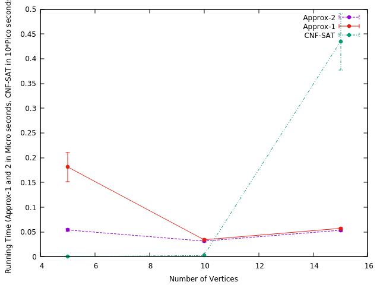
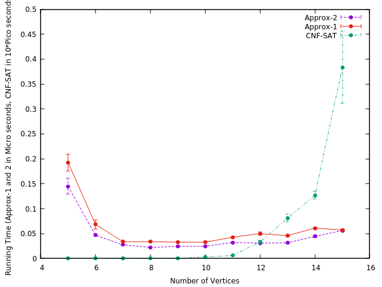
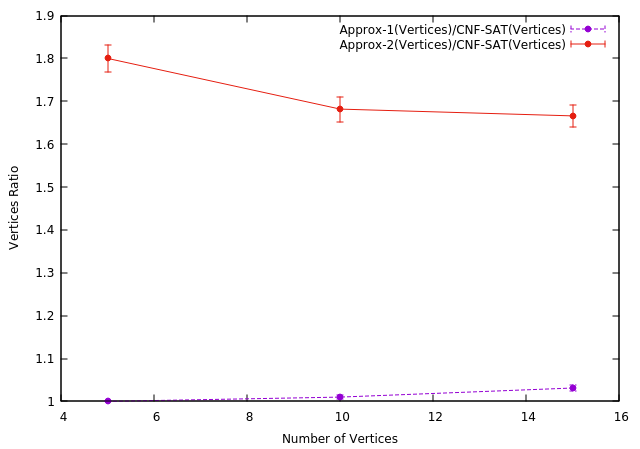
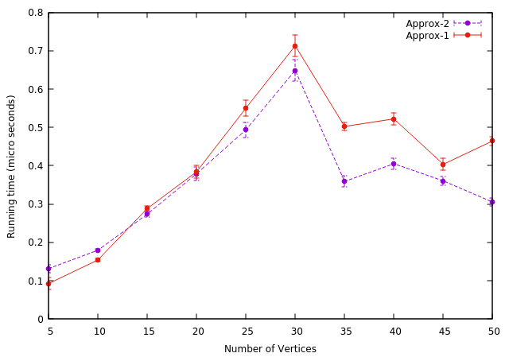

# Optimal-Analysis-of-Vertex-Cover-Using-Various-Algorithms

The main objective of the project is to cover Vertices in an optimum possible way. This
goal can be achieved by using Minimum vertex cover optimization problem which is a typical example of an NP-complete problem that has an approximation algorithm. 
These algorithms are: 
- Approx-VC-1 (as described in the instructions)
- Approx-VC-2 (as described in the instructions)
- CNF-SAT-VC (as described in the instructions)

### Algorithms
1. CNF-SAT: 
CNF is a dis-junction of literals which means logical OR is performed on literals and
Logical AND is performed on clauses. These clauses are then provided to MiniSat SAT
solver inorder to determine satisfiable conditions (if vertex cover is present for current
graph). 
2. Multithreading: 
To start a thread we simply need to create a new thread object and pass the executing code to be called . Once the object is created new thread is launched and this executes the code in specified call. 
3. Approx-VC-1: 
Vertex with highest degree is considered which means the vertex which occurs most frequently. This vertex is then added to the vertex cover list and edges being removed that are attached to these vertex. The process is repeated until no edges remains. 
4. Approx-VC-2: 
In this approach the Vertex Cover uses an arbitary edge (u,v) from set of edges E. The Edges connected to these both vertices are deleted and this process is continued until no edges remain 

## Output 

### Run time of CNF-SAT-VC
 
 
 
### Run Time analysis for Vertice range [5,15]
 
 
  
  ### Run Time analysis for Vertice range [5,50]
 
 
  
  ### Approximate Ratio for Vertice range [5,15]
 

### Approximate Ratio for Vertice range [5,50]
 
 

 # Conclusion
 Obviously the sat solver returned optimal results and was used as the control and benchmark for the approximation ratio results. It is important to note that for larger graphs the CNF-SAT-VC algorithm quickly becomes intractable due to its exponential nature. 
 Depending on the application, it would be good to consider an approximation method when graph inputs become larger than 15 vertices. 
 In conclusion, when we consider Approximation ratio APPROX-VC-1 algorithm becomes more efficient than the APPROX-VC-2. When running time is the constriction of design APPROX-VC-2 should be the preferred algorithm to compute vertex covers because it takes the least time amongst all the three. However, if the main focus is to find minimum vertex then, APPROX-VC-2 is more likely to fail.

# References :
1. CNF-SAT (https://www.geeksforgeeks.org/2-satisfiability-2-sat-problem/)
2. MultiThreading (https://www.geeksforgeeks.org/multithreading-in-cpp/)
3. Vertex Cover (https://www.geeksforgeeks.org/vertex-cover-problem-set-1-introductionapproximate-algorithm-2/)
4. Concurrency (https://www.toptal.com/software/introduction-to-concurrent-programming)
5. Run time measure (https://man7.org/linux/man-pages/man3/pthreadgetcpuclockid.3.html)
  

