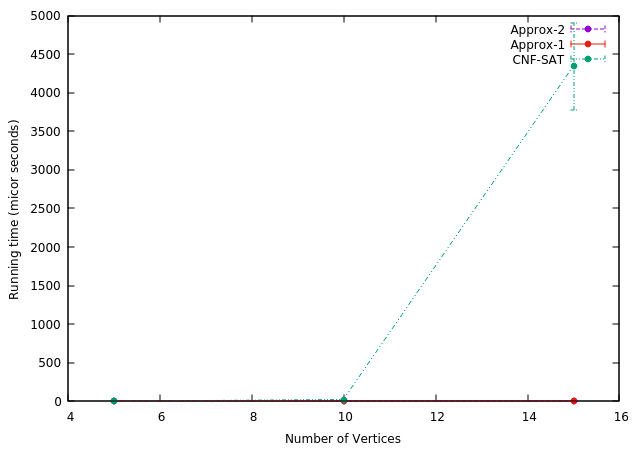

# Optimal-Analysis-of-Vertex-Cover-Using-Various-Algorithms

The main objective of the project is to cover Vertices in an optimum possible way. This
goal can be achieved by using Minimum vertex cover optimization problem which is a typical example of an NP-complete problem that has an approximation algorithm. 
These algorithms are: 
- Approx-VC-1 (as described in the instructions)
- Approx-VC-2 (as described in the instructions)
- CNF-SAT-VC (as described in the instructions)

### Algorithms
1. CNF-SAT: 
CNF is a dis-junction of literals which means logical OR is performed on literals and
Logical AND is performed on clauses. These clauses are then provided to MiniSat SAT
solver inorder to determine satisfiable conditions (if vertex cover is present for current
graph). 
2. Multithreading: 
To start a thread we simply need to create a new thread object and pass the executing code to be called . Once the object is created new thread is launched and this executes the code in specified call. 
3. Approx-VC-1: 
Vertex with highest degree is considered which means the vertex which occurs most frequently. This vertex is then added to the vertex cover list and edges being removed that are attached to these vertex. The process is repeated until no edges remains. 
4. Approx-VC-2: 
In this approach the Vertex Cover uses an arbitary edge (u,v) from set of edges E. The Edges connected to these both vertices are deleted and this process is continued until no edges remain 

## Output 

### Run time of CNF-SAT-VC

